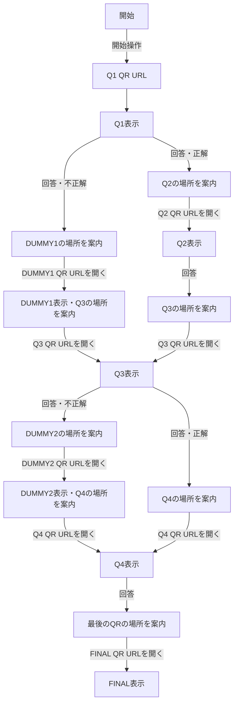

# 実装仕様

> この文書は2026-10-08時点の実装を記録する。ゲームの意図・要求は [`proposal_game_design_concept.md`](proposal_game_design_concept.md) を参照する。コード、ルーティング、画面、データ、実行方法、デプロイ設定を変更した場合は、同じ作業で本書も更新し、両者の一致を確認する。

## 1. 概要

ブラウザー上で動作する、ホテル内の手がかり探索を想定したプロポーズゲームのプロトタイプ。プレイヤーは問題に回答しただけでは次のノードへ進まず、案内された場所で次のQRに対応するURLを開く。実QRのカメラ読取は未実装であり、URLを直接開く操作が読取の代替となる。

- プレイヤー画面は問題、4択、回答受領、行き先案内、DUMMY案内、FINALの内容に絞る。
- 管理画面は回答の選択と正誤、進行、部屋番号、メッセージ、停止・一時停止・リセット、QR対応表を扱う。
- HTML/CSS/JavaScriptのみで動作し、ゲーム状態は同一オリジンの`localStorage`に保存する。
- 認証、サーバーAPI、外部DB、実際のQR生成・読取、端末間通信はない。

## 2. ファイルと実行構成

| ファイル                      | 責務                                                                        |
| ----------------------------- | --------------------------------------------------------------------------- |
| `index.html`                  | ブランド表示、管理者リンク、描画領域、CSS/JS読み込み。                      |
| `app.js`                      | 問題・QRデータ、ルート解析、進行状態、画面描画、プレイヤー/管理者イベント。 |
| `styles.css`                  | プレイヤーと管理者の表示、既存配色、モバイル用レイアウト。                  |
| `server.js`                   | Node.js標準HTTPモジュールによる静的ファイル配信。ゲーム状態を扱わない。     |
| `.github/workflows/pages.yml` | `main`へのpushまたは手動実行でGitHub Pagesへ静的ファイルを配信する。        |

VS Codeタスク「Run proposal game prototype」は`node server.js`を実行し、`http://127.0.0.1:4173`で待ち受ける。プレイヤー開始画面は`http://127.0.0.1:4173/`、管理画面は同じオリジンの`/#/admin`。QRは`#/g/{publicQrId}`のハッシュルートである。

## 3. ノードとQRデータ

内部ノードIDとプレイヤー向け公開QR IDを分離する。`qrEntries`が公開IDから内部ノードへの対応と管理者向け用途を保持する。問題や正誤ルートは内部ノードIDを使い、プレイヤー用URLには公開IDだけを含める。

| 公開QR ID  | 内部ノード | 用途       | URL形式         |
| ---------- | ---------- | ---------- | --------------- |
| `7fK3mP9x` | Q1         | 1問目      | `/#/g/7fK3mP9x` |
| `A82kd91L` | Q2         | 2問目      | `/#/g/A82kd91L` |
| `xQ7m2Nz4` | Q3         | 3問目      | `/#/g/xQ7m2Nz4` |
| `r5Vn8B2c` | Q4         | 4問目      | `/#/g/r5Vn8B2c` |
| `M4pZ7aQ9` | DUMMY1     | 誤答ルート | `/#/g/M4pZ7aQ9` |
| `cN6w3Kx8` | DUMMY2     | 誤答ルート | `/#/g/cN6w3Kx8` |
| `H2dR9sL5` | FINAL      | 最終案内   | `/#/g/H2dR9sL5` |

IDはランダムに見える固定値で、ゲーム構造をURLから推測しにくくするためのもの。実行ごとに生成・更新はしないため、設置用URLはこの対応を保つ。URLの秘匿はセキュリティ対策ではなく、正解・問題・遷移ロジックもクライアントへ配信される。

`questions`は問題文、4択、正解、正解/不正解時の内部次ノード、案内文を保持する。`dummyNodes`はDUMMYの表示文、次の行き先案内、次ノードを保持する。公開IDから内部ノードを引くルート層と、内部ノードから問題・画面を選ぶ描画層を分けている。

| 現ノード | 正解時の次ノード | 不正解時の次ノード | 回答後の案内              |
| -------- | ---------------- | ------------------ | ------------------------- |
| Q1       | Q2               | DUMMY1             | 正解/不正解別の場所案内   |
| Q2       | Q3               | Q3                 | 共通案内                  |
| Q3       | Q4               | DUMMY2             | 正解/不正解別の場所案内   |
| Q4       | FINAL            | FINAL              | 最後のQRがある場所        |
| DUMMY1   | Q3               | 該当なし           | DUMMY画面にQ3の場所を案内 |
| DUMMY2   | Q4               | 該当なし           | DUMMY画面にQ4の場所を案内 |

## 4. URLと進行制御

### 4.1 プレイヤーURL

- 開始画面はハッシュなし（または`#/`）。「はじめる」で`expectedNode=Q1`を保存し、Q1の公開QR URLへ移動する。
- QR URLは`#/g/{8文字の公開QR ID}`。ルート解析後、`qrEntries`から内部ノードを得る。
- `#/game/q1`、`#/game/q2`、`#/game/q3`、`#/game/q4`、`#/game/dummy1`、`#/game/dummy2`、`#/game/final`は旧形式であり、プレイヤー遷移としては扱わない。これらは開始画面へフォールバックする。
- `#/admin`は管理画面。その他の不正ルートは開始画面へフォールバックし、不明な`#/g/{id}`は利用できない案内を表示する。

### 4.2 QR到達をトリガーにした進行

状態オブジェクトは少なくとも`status`、`currentNode`、`expectedNode`、`answers`、`roomNumber`、`message`、時刻、FINAL確認状態を持つ。

1. 回答イベントは正誤と`nextNode`を判定し、回答履歴へ選択内容・正誤・時刻を保存する。同時に`expectedNode`へ分岐先を保存する。
2. 回答イベントではURLと`currentNode`を変更しない。プレイヤーには「回答を受け取りました」、次の手がかり、行き先だけを表示する。正誤・内部IDは表示しない。
3. `expectedNode`に対応するQR URLが開かれた時だけ、`currentNode`をそのノードへ更新し、問題またはDUMMY/FINALを描画する。
4. QRを開いた後の再読込は、現在ノードと同じQR IDなら許可する。まだ期待されていない別のQR IDを直接開いた場合はノードを表示せず、「この手がかりは、まだ開けません」と案内する。
5. DUMMYのQR到達時には、そのDUMMYを現在ノードとして記録し、次の問題ノードを`expectedNode`に設定する。DUMMY画面に次ノードへ移動するボタンはない。
6. FINALもQ4回答後にFINAL用QR URLが開かれて初めて表示される。確認後はstatusを`finished`にし、FINAL画面内に確認結果を表示する。



## 5. プレイヤー画面

- ヘッダーはブランド表示だけ。管理画面リンク、開発用フッター、内部ノード名、`QUESTION`等の開発ラベル、進捗表示、テスト用ノードリンクは表示しない。
- 開始画面は短い導入と開始ボタン。
- Q1〜Q4は問題文とA〜Dの4択。回答済みなら選択肢を無効化し、受領文と次の場所の案内を表示する。次ノードへ進むボタンはない。
- DUMMY画面は自然な見出し、短い案内、次の場所の説明だけを表示する。正解/不正解は示さず、移動ボタンもない。
- FINALは4桁の部屋番号、「この答えに自信がありますか？」、確認操作を表示する。内部ノード名・テストリンク・開発情報は表示しない。
- 一時停止/停止中は待機案内と管理者メッセージを表示する。
- ブランド以外のヘッダー項目と開発フッターをプレイヤー画面から除去している。

## 6. 管理者画面

`/#/admin`にある。ログイン認証はない。ページ共通ヘッダーの「管理画面」リンクは管理画面上でのみ表示される。

- ゲーム状態、現在の内部ノード、次に期待する内部ノード、進捗、回答件数、経過時間を表示する。
- Q1〜Q4の回答、選択内容、正誤、回答時刻を表示する。
- 部屋番号（4桁）、プレイヤー向けメッセージを確認・変更する。
- 一時停止/再開、停止、リセットができる。リセット後も部屋番号を保持する。
- QR対応表に公開ID、内部ノード、用途、実URLを表示する。URLコピー操作と新しいタブでのテスト表示を用意する。
- QRテスト表示は`#/g/{id}?preview=1`を利用し、現在の進行状態を変更しない。プレビュー画面の回答操作は無効にする。
- 管理画面のQR一覧・内部ノード名はプレイヤー画面には描画しない。

## 7. 保存と同期

`localStorage`のキーは`proposal-game-prototype-v1`。`saveState(mutator)`は最新値を読み直し、変更して保存後、同じタブを再描画する。別タブの変更は`storage`イベントで再描画する。同一オリジンの同じ保存領域に限られ、異なるホスト名・端末間では共有されない。

回答履歴はノードごとに1件を想定し、回答記録に選択肢、`isCorrect`、分岐先`nextNode`、時刻を含む。プレイヤーには`isCorrect`や内部`nextNode`を直接表示しない。

## 8. 既知の制約とセキュリティ上の位置づけ

- 公開QR IDは固定のランダム風文字列であり、暗号学的な認可トークンではない。URLだけからゲーム構造を推測しにくくする表示上の設計である。
- `localStorage`に基づく期待ノード確認は、同じブラウザー・同じ端末のMVP向け。別のスマートフォンではプレイヤーの進行状態を共有できないため、実ホテル運用にはサーバー側状態管理が必要。
- クライアントに問題、正解、分岐ロジック、全QR対応が配信される。開発者ツールやソースから内容を調べられ、URLへ`?preview=1`を付ければ状態を変えない表示プレビューも可能。正解秘匿・改ざん防止・認証を提供しない。
- 管理画面はURLを知る利用者が開ける。管理者認証や権限分離はない。
- QRのカメラ読取・QR画像生成・印刷・ホテル内設置は未実装。テストでは管理画面のURLをブラウザーで直接開く。
- 静的サーバーはローカルホストで配信する。物理スマートフォンで試すには、同一ネットワークから到達できるHTTPS等のホスト環境を別途用意する必要がある。
- 部屋番号や問題文などはプロトタイプの固定データであり、本番内容ではない。

## 9. GitHub Pagesでの一時公開

GitHub Pages向けのGitHub Actions workflowを`.github/workflows/pages.yml`に追加した。公開先はremote `https://github.com/kanekonaokisu-cyber/proposal_game_v2.git`に基づくプロジェクトページURL:

```text
https://kanekonaokisu-cyber.github.io/proposal_game_v2/
```

workflowは`main`へのpush、またはActions画面からの`workflow_dispatch`で起動する。GitHub ActionsでPagesを配信できるよう、リポジトリの **Settings > Pages > Build and deployment > Source** を **GitHub Actions** に設定する。workflowはcheckout後、`index.html`、`app.js`、`styles.css`だけをartifactへステージしてPagesへdeployする。`server.js`、`.vscode`、設計文書はサイトartifactに含めない。

### 公開URLとQR

- `index.html`のCSS/JS参照は相対パスであり、プロジェクトページの`/proposal_game_v2/`配下でも読み込める。
- `qrUrl()`は`window.location.origin + window.location.pathname + "#/g/" + publicQrId`を生成する。Pages上では上記の公開base pathを使うため、管理画面のQR対応表からコピーしたURLは`https://kanekonaokisu-cyber.github.io/proposal_game_v2/#/g/{id}`の形になる。
- `qrEntries`の公開IDとhash route形式を変えなければ、同じ公開URL上でQRを再印刷せず継続利用できる。数週間後に公開を停止し、同じユーザー/リポジトリ名とPages設定で再公開する限り、URLは同じままになる。
- リポジトリ名、GitHubユーザー/組織名、Pagesの公開設定、または独自ドメインを変更するとbase URLが変わり得る。公開後にこれらを変えないこと。
- これは静的サイトの公開で、GitHub remoteへworkflowをpushし、Pages設定を有効にするまでは未公開。初回Actions成功と実URLの到達確認は未実施。
- 現在のローカルURL（`127.0.0.1:4173`）を既にQRへ印刷している場合、そのQRは公開後のURLへ読み替わらない。印刷前にPagesへ公開し、管理画面のQR対応表から公開URLを取得する必要がある。アプリはQR画像を生成しない。

### 一時公開の制約

公開後もゲームstateは各ブラウザーのlocalStorageに保存される。プレイヤーと管理者を別端末で使うと状態・回答・メッセージは同期しない。複数タブ同期も同一origin内に限る。正解・分岐・QR対応表はクライアントJavaScriptから閲覧でき、管理画面に認証はないため、公開中はテスト用内容・部屋番号を使い、本番の秘密情報を置かない。

## 10. 手動確認シナリオ

### 正解ルート

1. 開始画面から開始し、Q1公開QR URLが開いてQ1を表示する。
2. Q1に正解すると回答受領とQ2の案内が表示される。Q2問題は表示されず、プレイヤーに遷移ボタンもない。
3. Q2用QR URLを開いてQ2を表示する。同様にQ2回答後はQ3用QR URLを開くまでQ3を表示しない。
4. Q3、Q4も同様に回答とQR到達を分離し、Q4回答後はFINAL用QR URLを開いて初めてFINALを表示する。
5. FINALで部屋番号と自信確認を表示し、確認後は終了状態となる。

### Q1不正解ルート

1. Q1で不正解を選ぶ。正誤は表示せず、DUMMY1の場所を案内する。
2. DUMMY1用QR URLを開くまでDUMMY1を表示しない。
3. DUMMY1表示でQ3の場所を案内する。Q3用QR URLを開くまでQ3は表示されない。

### Q3不正解ルート

1. Q3で不正解を選ぶ。正誤は表示せず、DUMMY2の場所を案内する。
2. DUMMY2用QR URLを開いてDUMMY2を表示し、次にQ4の場所を案内する。
3. Q4用QR URLを開いてQ4を表示する。

### URL・管理画面

- 回答直後にURLが次QRへ変わらず、次ノードの問題も表示されない。
- 期待されていない先のQR URLはブロックされる。現在のQR URLを再読込すると現在ノードを再表示する。
- 管理画面に7件の公開ID・内部ノード・用途・URLが揃い、コピーと状態非変更プレビューを確認できる。
- プレイヤー画面に管理画面リンク、テストリンク、内部進行情報、開発用ラベルがない。
