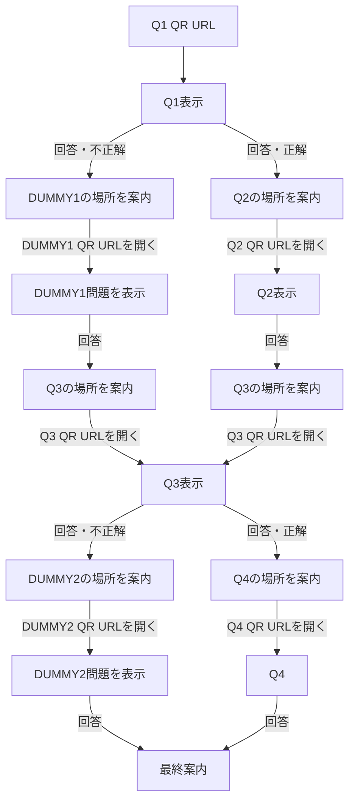

# 実装仕様

> この文書は2026-10-10時点の実装を記録する。ゲームの意図・要求は [`proposal_game_design_concept.md`](proposal_game_design_concept.md) を参照する。コード、ルーティング、画面、データ、実行方法、デプロイ設定を変更した場合は、同じ作業で本書も更新し、両者の一致を確認する。

## 1. 概要

ブラウザー上で動作する、ホテル内の手がかり探索を想定したプロポーズゲームのプロトタイプ。サイトルートには管理者が設定した場所へQ1のQRコードを探しに行く案内を表示し、Q1のQRコードからゲームを開始する。回答後に案内された場所で次のQRコードを読み込む。通常の問題QRは一度だけ回答できるが、最終確認で未正解の問題は再回答する。実QRのカメラ読取は未実装であり、スマートフォンのカメラ等でQRを読み込んでURLを開く。

- プレイヤー画面はQ1への案内、問題、4択、回答受領、行き先案内、最終確認とFINALを表示する。誤答ルートQR（DUMMY1/DUMMY2）でも管理者設定の問題を出題する。
- 管理画面は回答の選択と正誤、進行、部屋番号、メッセージ、停止・一時停止・リセット、QR対応表を扱う。
- HTML/CSS/JavaScriptのみで動作し、ゲーム状態は同一オリジンの`localStorage`に保存する。
- 認証、サーバーAPI、外部DB、QRカメラ読取、端末間通信はない。QR生成はブラウザー内で行う。

## 2. ファイルと実行構成

| ファイル                      | 責務                                                                        |
| ----------------------------- | --------------------------------------------------------------------------- |
| `index.html`                  | ブランド表示、管理者リンク、描画領域、CSS/JS読み込み。                      |
| `app.js`                      | 問題・QRデータ、ルート解析、進行状態、画面描画、プレイヤー/管理者イベント。 |
| `styles.css`                  | プレイヤーと管理者の表示、既存配色、モバイル用レイアウト。                  |
| `vendor/qrcode-generator.js` | MITライセンスのローカルQR生成ライブラリ。                                  |
| `server.js`                   | Node.js標準HTTPモジュールによる静的ファイル配信。ゲーム状態を扱わない。     |
| `.github/workflows/pages.yml` | `main`へのpushまたは手動実行でGitHub Pagesへ静的ファイルを配信する。        |

VS Codeタスク「Run proposal game prototype」は`node server.js`を実行し、`http://127.0.0.1:4173`で待ち受ける。プレイヤーはサイトルートまたは`/#/start`でQ1への案内を表示し、各QRの`#/g/{publicQrId}`ハッシュルートから問題を開く。Q1のQR URLは案内ページを経由せず直接Q1を開ける。管理画面は同じオリジンの`/#/admin`。

## 3. ノードとQRデータ

内部ノードIDとプレイヤー向け公開QR IDを分離する。`qrEntries`が公開IDから内部ノードへの対応と管理者向け用途を保持する。問題や正誤ルートは内部ノードIDを使い、プレイヤー用URLには公開IDだけを含める。

| 公開QR ID  | 内部ノード | 用途       | URL形式         |
| ---------- | ---------- | ---------- | --------------- |
| `7fK3mP9x` | Q1         | 1問目      | `/#/g/7fK3mP9x` |
| `A82kd91L` | Q2         | 2問目      | `/#/g/A82kd91L` |
| `xQ7m2Nz4` | Q3         | 3問目      | `/#/g/xQ7m2Nz4` |
| `r5Vn8B2c` | Q4         | 4問目      | `/#/g/r5Vn8B2c` |
| `M4pZ7aQ9` | DUMMY1     | 誤答ルート | `/#/g/M4pZ7aQ9` |
| `cN6w3Kx8` | DUMMY2     | 誤答ルート | `/#/g/cN6w3Kx8` |

IDはランダムに見える固定値で、ゲーム構造をURLから推測しにくくするためのもの。実行ごとに生成・更新はしないため、設置用URLはこの対応を保つ。URLの秘匿はセキュリティ対策ではなく、正解・問題・遷移ロジックもクライアントへ配信される。

`questions`はQ1〜Q4とDUMMY1/DUMMY2の問題文、4択、正解/不正解時それぞれの内部次ノードと案内文を保持する。開始案内の場所も同じ共有JSONの`startLocation`に保存する。問題、分岐、開始場所は管理画面で設定する。公開IDから内部ノードを引くルート層と、内部ノードから問題・画面を選ぶ描画層を分けている。

| 現ノード | 正解時の次ノード | 不正解時の次ノード | 回答後の案内              |
| -------- | ---------------- | ------------------ | ------------------------- |
| Q1       | Q2               | DUMMY1             | 正解/不正解別に設定        |
| Q2       | Q3               | Q3                 | 正解/不正解別に設定        |
| Q3       | Q4               | DUMMY2             | 正解/不正解別に設定        |
| Q4       | FINAL            | FINAL              | 正解/不正解別に設定        |
| DUMMY1   | Q3               | Q3                 | 正解/不正解別に設定        |
| DUMMY2   | FINAL            | FINAL              | 正解/不正解別に設定        |

## 4. URLと進行制御

### 4.1 プレイヤーURL

- サイトルート（`/`）または`/#/start`では管理者設定の場所を使い「○○へ向かってQRコードを探してください」と表示する。この案内ページに操作ボタンはなく、Q1のQR URLを直接開くと`status=active`となりQ1を表示する。
- QR URLは`#/g/{8文字の公開QR ID}`。ルート解析後、`qrEntries`から内部ノードを得る。
- `#/game/q1`、`#/game/q2`、`#/game/q3`、`#/game/q4`、`#/game/dummy1`、`#/game/dummy2`、`#/game/final`は旧形式であり、プレイヤー遷移としては扱わない。これらはQ1 QRルートへ転送する。
- `#/admin`は管理画面。その他の不正ルートはQ1 QRルートへ転送し、不明な`#/g/{id}`は利用できない案内を表示する。

### 4.2 QR到達をトリガーにした進行

状態オブジェクトは少なくとも`status`、`currentNode`、`expectedNode`、`answers`、`roomNumber`、`message`、時刻、FINAL確認状態を持つ。

1. Q1のQR到達がゲーム開始操作を兼ねる。サイトルートはQ1設置場所への案内だけを表示する。
2. 回答イベントは正誤と`nextNode`を判定し、回答履歴へ選択内容・正誤・時刻を保存する。同時に`expectedNode`へ分岐先を保存する。通常ルートではURLと`currentNode`は変更せず、その場で回答受領と次の場所の案内を表示する。正誤・内部IDは表示しない。分岐先がFINALなら直ちに最終案内を表示する。
3. `expectedNode`に対応するQR URLが開かれた時だけ、`currentNode`をそのノードへ更新し、問題を描画する。
4. 回答済みの問題QRを再度開いた場合は、選択肢を再表示せず、次のQRコードを読み込むよう案内する。回答直後の同じページでは行き先案内を表示し、ページを再読込・再訪した場合は回答済み案内を表示する。未回答の現在QRは再読込しても同じ問題を表示する。まだ期待されていない別のQR IDを直接開いた場合はノードを表示せず、「この手がかりは、まだ開けません」と案内する。
5. DUMMYのQR到達時には、そのDUMMYを現在ノードとして記録し、問題を表示する。DUMMY1回答後はQ3を`expectedNode`に設定し、DUMMY2回答後は最終案内を表示する。
6. Q4またはDUMMY2の回答後は追加のQR読取なしで最終確認を表示する。Q1〜Q4のいずれかに未正解があれば部屋番号を隠す。YESを押すたびに「ほんとに？？」と再確認し、NOで最初の未正解問題を再出題する。再回答を間違えると「違います…あなたは何も知らないのですね…」と表示し、正解するまで同じ問題を続ける。再正解した問題の正しい行き先を案内し、そのQRから後続を再開する。Q1〜Q4すべての正解を確認できた場合のみ部屋番号を表示する。



## 5. プレイヤー画面

- ヘッダーはブランド表示だけ。管理画面リンク、開発用フッター、内部ノード名、`QUESTION`等の開発ラベル、進捗表示、テスト用ノードリンクは表示しない。
- 問題は対応するQRコードを読み込んだ時だけ表示する。開始画面や開始ボタンは設けない。
- Q1〜Q4とDUMMY1/DUMMY2は問題文とA〜Dの4択。回答済みなら選択肢を無効化し、受領文と次の場所の案内を表示する。Q4/DUMMY2の回答後は最終案内を表示する。次ノードへ進むボタンはない。
- 回答済みの問題QRを再度開いた場合は再回答させず、次のQRコードを読み込むよう案内する。
- DUMMY1/DUMMY2では管理者設定の問題を表示する。正解/不正解は示さず、移動ボタンもない。
- FINALは4桁の部屋番号、「この答えに自信がありますか？」、確認操作を表示する。内部ノード名・テストリンク・開発情報は表示しない。
- 一時停止/停止中は待機案内と管理者メッセージを表示する。
- ブランド以外のヘッダー項目と開発フッターをプレイヤー画面から除去している。

## 6. 管理者画面

`/#/admin`にある。ログイン認証はない。ページ共通ヘッダーの「管理画面」リンクは管理画面上でのみ表示される。

- ゲーム状態、現在の内部ノード、次に期待する内部ノード、進捗、回答件数、経過時間を表示する。
- Q1〜Q4/DUMMY1/DUMMY2の回答、選択内容、正誤、回答時刻を表示する。
- 部屋番号（4桁）、プレイヤー向けメッセージを確認・変更する。
- 一時停止/再開、停止、リセットができる。リセット後も部屋番号を保持する。
- QR対応表に公開ID、内部ノード、用途、実URLを表示する。URLコピー操作と新しいタブでのテスト表示を用意する。
- QRテスト表示は`#/g/{id}?preview=1`を利用し、現在の進行状態を変更しない。プレビュー画面の回答操作は無効にする。
- 管理画面のQR一覧・内部ノード名はプレイヤー画面には描画しない。

## 7. 保存と同期

`localStorage`のキーは`proposal-game-prototype-v1`。`saveState(mutator)`は最新値を読み直し、変更して保存後、同じタブを再描画する。別タブの変更は`storage`イベントで再描画する。同一オリジンの同じ保存領域に限られ、異なるホスト名・端末間では共有されない。

回答履歴はノードごとに1件を想定し、回答記録に選択肢、`isCorrect`、分岐先`nextNode`、時刻を含む。プレイヤーには`isCorrect`や内部`nextNode`を直接表示しない。

## 8. 既知の制約とセキュリティ上の位置づけ

- 公開QR IDは固定のランダム風文字列であり、暗号学的な認可トークンではない。URLだけからゲーム構造を推測しにくくする表示上の設計である。
- `localStorage`に基づく期待ノード確認は、同じブラウザー・同じ端末のMVP向け。別のスマートフォンではプレイヤーの進行状態を共有できないため、実ホテル運用にはサーバー側状態管理が必要。
- クライアントに問題、正解、分岐ロジック、全QR対応が配信される。開発者ツールやソースから内容を調べられ、URLへ`?preview=1`を付ければ状態を変えない表示プレビューも可能。正解秘匿・改ざん防止・認証を提供しない。
- 管理画面はURLを知る利用者が開ける。管理者認証や権限分離はない。
- QRのカメラ読取・QR画像生成・印刷・ホテル内設置は未実装。テストでは管理画面のURLをブラウザーで直接開く。
- 静的サーバーはローカルホストで配信する。物理スマートフォンで試すには、同一ネットワークから到達できるHTTPS等のホスト環境を別途用意する必要がある。
- 部屋番号や問題文などはプロトタイプの固定データであり、本番内容ではない。

## 9. GitHub Pagesでの一時公開

GitHub Pages向けのGitHub Actions workflowを`.github/workflows/pages.yml`に追加し、2026-10-08にcommit `f987ad4`として`main`へpushした。公開先はremote `https://github.com/kanekonaokisu-cyber/proposal_game_v2.git`に基づくプロジェクトページURL:

```text
https://kanekonaokisu-cyber.github.io/proposal_game_v2/
```

workflowは`main`へのpush、またはActions画面からの`workflow_dispatch`で起動する。初回実行前にリポジトリの **Settings > Pages > Build and deployment > Source** を **GitHub Actions** に設定し、Pagesサイトを有効化する必要がある。workflowの`actions/configure-pages@v5`は既存サイトの設定を読み取るだけ（`enablement: false`）で、サイトの初回有効化は行わない。workflowはcheckout後、`index.html`、`app.js`、`styles.css`、`vendor/qrcode-generator.js`をartifactへステージしてPagesへdeployする。`server.js`、`.vscode`、設計文書はサイトartifactに含めない。

### 公開URLとQR

- `index.html`のCSS/JS参照は相対パスであり、プロジェクトページの`/proposal_game_v2/`配下でも読み込める。
- `qrUrl()`は`window.location.origin + window.location.pathname + "#/g/" + publicQrId`を生成する。Pages上では上記の公開base pathを使うため、管理画面のQR対応表からコピーしたURLは`https://kanekonaokisu-cyber.github.io/proposal_game_v2/#/g/{id}`の形になる。
- `qrEntries`の公開IDとhash route形式を変えなければ、同じ公開URL上でQRを再印刷せず継続利用できる。数週間後に公開を停止し、同じユーザー/リポジトリ名とPages設定で再公開する限り、URLは同じままになる。
- リポジトリ名、GitHubユーザー/組織名、Pagesの公開設定、または独自ドメインを変更するとbase URLが変わり得る。公開後にこれらを変えないこと。
- 2026-10-09にリポジトリをPublicへ変更し、**Settings > Pages > Build and deployment > Source** を **GitHub Actions** に設定した。10-08の初回workflow実行2回は、Pagesサイト未有効化により`Configure Pages`がPages APIの`404 Not Found`で失敗していた。設定後にworkflow run #3を手動実行し、全stepの成功を確認。公開URLもHTTP 200相当のページ内容を返し、デプロイ済み。Publicリポジトリのため、ソースコード、設計文書、Actionsの実行履歴とログは誰でも閲覧でき、リポジトリをforkできる。
- 現在のローカルURL（`127.0.0.1:4173`）を既にQRへ印刷している場合、そのQRは公開後のURLへ読み替わらない。印刷前にPagesへ公開し、管理画面のQR対応表から公開URLを取得する必要がある。アプリはQR画像を生成しない。

### 一時公開の制約

公開後もゲームstateは各ブラウザーのlocalStorageに保存される。プレイヤーと管理者を別端末で使うと状態・回答・メッセージは同期しない。複数タブ同期も同一origin内に限る。正解・分岐・QR対応表はクライアントJavaScriptから閲覧でき、管理画面に認証はないため、公開中はテスト用内容・部屋番号を使い、本番の秘密情報を置かない。

## 10. 手動確認シナリオ

### 正解ルート

1. サイトルートを開くと管理者が設定した場所へのQ1案内を表示する。Q1公開QR URLを直接開くとQ1を表示する。
2. Q1正解ではQ2、誤答ではDUMMY1の場所案内が表示される。URLと画面はそのままで、次のQR問題は表示されず、遷移ボタンもない。
3. Q1のQRを再度読み込むと「この問題には回答済みです」と表示し、次のQRを読み込むよう案内する。再回答できない。
4. 次に案内されたQRを読み込んでQ2/DUMMY等を表示する。以後も回答済みQRからは再回答できず、次のQR到達でのみ次のノードを表示する。
5. Q3正解ではQ4、誤答ではDUMMY2の場所を案内する。Q4/DUMMY2回答後は追加のQR読取なしで最終案内を表示する。
6. FINALで未正解がある場合は部屋番号を隠し、YES/NOの確認を表示する。NOで未正解問題を正解するまで再回答し、後続QRを再訪する。Q1〜Q4の正解後に部屋番号を表示する。すべて正解済みの場合は既存の確認操作後に終了状態となる。

### Q1不正解ルート

1. Q1で不正解を選ぶ。正誤は表示せず、DUMMY1の場所を案内する。
2. DUMMY1用QR URLを開くまでDUMMY1を表示しない。到達後は管理画面で設定した問題と4択を表示する。
3. DUMMY1に回答するとQ3の場所を案内する。Q3用QR URLを開くまでQ3は表示されない。

### Q3不正解ルート

1. Q3で不正解を選ぶ。正誤は表示せず、DUMMY2の場所を案内する。
2. DUMMY2用QR URLを開いて管理画面で設定した問題を表示する。回答すると最終案内を表示する。
3. Q3の正解ルートではQ4用QR URLを開いてQ4を表示し、回答後に最終案内を表示する。

### URL・管理画面

- サイトルートと`/#/start`は設定した場所への案内だけを表示し、Q1 QRは案内ページを介さず問題を表示する。
- 管理画面で開始案内の場所を編集・共有でき、保存後にプレイヤー端末へ反映される。
- 回答直後にURLが次QRへ変わらず、次ノードの問題も表示されない。
- 回答済みQRを再度開いても再回答できず、次QRの読込を案内する。期待されていない先のQR URLはブロックされる。
- 未回答の現在QRを再読込すると同じ問題を再表示し、回答済みのページを再読込すると次QRの読込を案内する。
- 管理画面に6件の公開ID・内部ノード・用途・QR画像・URLが揃い、画像/URLコピーと状態非変更プレビューを確認できる。正解時/誤答時の行き先はラジオ選択で設定する。
- QR画像はブラウザー内で生成し、外部サービスへURLを送信しない。管理画面からクリップボードへPNG画像をコピーでき、非対応ブラウザーでは画像を右クリック/長押しして保存する。
- プレイヤー画面に管理画面リンク、テストリンク、内部進行情報、開発用ラベルがない。
- Q1〜Q4の未正解が残った状態で最後の問題へ到達すると部屋番号が表示されず、NOから未正解問題を正解するまで繰り返す。
